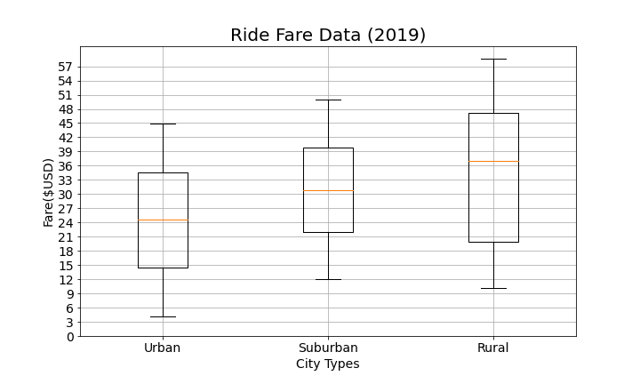

# PyBer Analysis

# Overview of Analysis 

In our latest analysis we reviewed PyBer ride data in urban, suburban and rural cities for the first quarter of 2019 (January-April) to identify possible disparities between them in the categories of drivers, rides and fares. 

# Results 

Our analysis found disparities in the average number of drivers, average fares and average ridership for each city type. 

## Key Metrics by City Type

### Total Rides 

Overall rides totaled 2,375.
There was a total of 1,625 rides in urban cities. 
There was a total of 625 rides in suburban cities. 
There was a total of 125 rides in rural cities. 

### Total Drivers 

There was a total of 2,973 drivers. 
Urban cities had 2,405 drivers. 
Suburban cities had 490 drivers. 
Rural cities had 78 drivers. 

### Total Fares 

Fares in the first quarter totaled $63,538.64. 

### Average Fare per Ride 

Average fare per ride in urban cities was $24.53.
Average fare per ride in suburban cities was $30.97. 
Average fare per ride in rural cities was $34.62. 

### Average Fare per Driver

Average fare per driver in urban cities was $16.57.
Average fare per driver in suburban cities was $39.50.
Average fare per driver in rural cities was $55.49.

### Total Fare by City Type

Fares in urban cities totaled $39,854.38.
Fares in suburban cities totaled $19,356.33.
Fares in rural cities totaled $4,327.93. 

## Final Assessments 

Individual rides cost more in rural areas on average than in suburban and urban cities. This is likely due to traveling longer distances, but we should run an analysis of average mileage by city type to confirm that is the case.  

Urban cities have a higher volume of ridership than suburban and rural cities, which is likely due to the population density of urban areas and likelihood that there are less vehicles per capita, so most people depend on public transportation or ride-sharing services. Again, we should conduct an analysis that looks at the population of these cities and the number of cars per resident to confirm. 

There are much more drivers in urban cities than suburban and rural locations. This is likely due to higher demand for drivers in urban areas, but it is worth doing a market analysis to see if that is indeed the case. 

When looking at the data overall, despite urban cities having a lower average cost per ride, the volume of ridership more than makes up for the disparity as urban areas consistently generated higher revenues compared to other city types. Urban cities made up 62.7% of revenue, while suburban cities delivered 30.5% and rural cities accounted for 6.8% of fares collected. 

*Note: Urban cities consistently make more money through fares than suburban and rural cities.*

# Recommendations
Based on our analysis of the data, we recommend three interdependent actions to address the disparities between city types.

1. **Offer discounts for rural destinations:** The higher cost of rides in rural areas likely turns off customers and leads them to opt for alternatives. 

2. **Implement surge pricing in urban areas:** As we saw in the analysis, urban areas have a much higher volume of rides, but average fares per ride are the lowest of the three city types. We should look at which timeframes each day have the highest volume of rides and increase the cost rides during those periods. This would allow us to make up for the previously-recommended discounts in rural areas. 

3. **Consider incentivizing driving in rural in suburban cities to increase the average number of rides for those types of cities:** Conduct additional research to analyze population distributions with a focus on suburban and rural cities as they have low driver counts compared to the average number of urban drivers. This is likely due to smaller, more spread out populations, but the low number of drivers could also be a factor influencing the lower number of rides in suburban and rural areas. It’s possible more drivers in these areas could increase ridership – and consequently – revenue. 

To conclude, we should dive deeper into other data before making major business decisions based on this analysis. 

